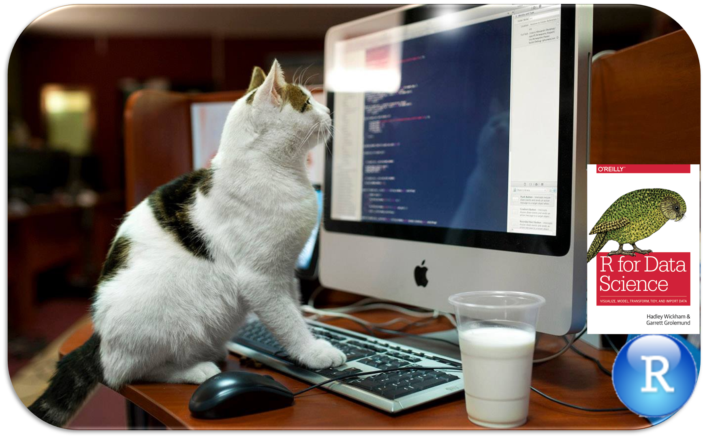

---
output:
  xaringan::moon_reader:
    yolo: false
    lib_dir: libs
    css: xaringan-themer.css
    seal: false
    nature:
      #autoplay: 30000
      #countdown: 60000
      highlightStyle: github
      highlightLines: true
      highlightSpans: true
      countIncrementalSlides: false
      #ratio: 16:9
      slideNumberFormat: "%current%"
editor_options: 
  chunk_output_type: console
---

```{r setup, include=FALSE}
options(htmltools.dir.version = FALSE)

knitr::opts_chunk$set(echo = TRUE, 
                      tidy = 'styler', 
                      comment = NA,
                      message = FALSE,
                      warning = FALSE)
```


```{r xaringan-themer, include=FALSE, warning=FALSE}
library(xaringanthemer)
style_duo_accent(
  primary_color = "#1381B0",
  secondary_color = "#FF961C",
  inverse_header_color = "#FFFFFF"
)

# Loaded packages

install.load::install_load(c("knitr", "xaringanExtra", "xaringan", "tidyverse", "kableExtra", "countdown", "janitor", "bulkreadr", "forstringr"))

xaringanExtra::use_xaringan_extra(include = c("tile_view", "editable", "share_again", "broadcast", "animate_css", "panelset", "tachyons", "fit_screen", "clipboard", "search", "scribble", "freezeframe"))

use_webcam(width = 150, height = 150)

use_extra_styles()

```

background-image: url(images/logo.png), url(images/logo.svg)
background-position: 0% 100%, 100% 0%
background-size: 10%, 15%

class: title-page, center, middle

## bulkreadr: The Ultimate Tool for Reading Data in Bulk

```{r, echo=FALSE}
use_logo(
  image_url = "images/logo.png",
  link_url = "https://bit.ly/gbganalyst",
  position = xaringanExtra::css_position(top = "1em", right = "1em"),
  exclude_class = c("title-page", "inverse", "hide_logo")
)
```


---
class: about-me-slide, inverse, middle, center

## About Me


### Ezekiel Adebayo Ogundepo

#### Fellow

.fade[Global Partnership for Sustainable Data]


[`r icons::fontawesome("link")` https://bit.ly/gbganalyst](https://bit.ly/gbganalyst)
[`r icons::fontawesome("twitter")` @gbganalyst](https://twitter.com/gbganalyst)
[`r icons::icon_style(icons::fontawesome("github"), scale = 1)` @gbganalyst](https://github.com/gbganalyst)

---
class: inverse, middle, center

## Why `bulkreadr` package?

```{r, echo=FALSE, fig.align='center', out.height= "25%", out.width= "30%"}
knitr::include_graphics("images/logo.png")
```

---
class: middle

## Why `bulkreadr` package?

```{r, echo=FALSE, fig.align='center', out.height= "90%", out.width= "70%"}

```


---
class: middle

## Excel/Google Sheets Workbook

```{r, echo=FALSE, fig.align='left', out.height= "90%", out.width= "90%"}
knitr::include_graphics("images/diamond.png")
```


---
class: middle, hide_logo

## Labelled data

```{r, echo=FALSE, fig.align='center'}

```
--

```{r, echo=FALSE, fig.align='center'}

```


---
class: inverse, middle, center


## Concept map

---
class: middle, hide_logo

## Concept map

```{r, echo=FALSE, fig.align='center'}
knitr::include_graphics("images/concept-map.png")
```


---
class: inverse, middle, center


## Context

---
class: middle

## Context

.w-100.lh-copy[

bulkreadr draws on and complements / emulates other packages such as readxl, readr, and googlesheets4 to read bulk data in R.
]

--

.w-100.lh-copy[

  * [readxl](https://readxl.tidyverse.org) is the tidyverse package for reading Excel files (xls or xlsx) into an R data frame. 

]

--

.w-100.lh-copy[

  * [readr](https://readr.tidyverse.org) is the tidyverse package for reading delimited files (e.g., csv or tsv) into an R data frame. ]
  
--

.w-100.lh-copy[

  * [googlesheets4](https://cran.r-project.org/package=googlesheets) is the package to interact with Google Sheets through the Sheets API v4  <https://developers.google.com/sheets/api>.
]


---
class: inverse, middle, center


## Installation

---
class: middle

## Installation

- CRAN

--

```{r, eval=FALSE}

install.packages("bulkreadr")

```

--

- Github

--

```{r, eval=FALSE}

devtools::install_github("gbganalyst/bulkreadr")

```


---
class: inverse, middle, center


## Hands-on


---

## Lab session

```{r, echo=FALSE}

```


---
class: inverse, middle, center


## How to contribute 

```{r, echo=FALSE, fig.align='center', out.height= "25%", out.width= "30%"}
knitr::include_graphics("images/logo.png")
```

---
class: middle

## How to contribute?

You can contribute to the development of this package by:

.w-100.lh-copy[
- `star`/`clone` the package repository via <https://github.com/gbganalyst/bulkreadr>
]

--

.w-100.lh-copy[

- filing an issue if you detect a bug  https://github.com/gbganalyst/bulkreadr/issues.

]

--

.w-100.lh-copy[

- Donate
]


---
class: center, middle, inverse

# The end

--

**Thank you**
